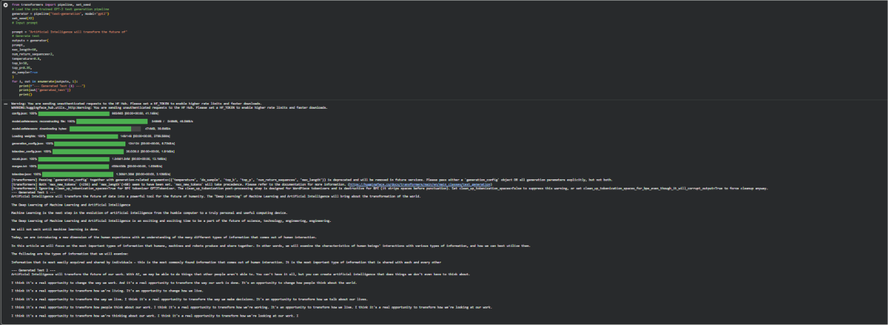

# 🧠 Experiment 01 - Text Generation Using Pre-trained Foundation Models

## 🎯 Aim

To generate text using a pre-trained foundation model and understand
how different generation parameters influence the generated output.

## 📖 Description

This experiment demonstrates text generation using the pre-trained
GPT-2 model from Hugging Face Transformers.

The model receives an initial prompt and predicts the following text
based on the patterns learned during pre-training.

## 🛠️ Technologies Used

- Python
- Hugging Face Transformers
- GPT-2
- PyTorch

## ⚙️ Parameters Used

| Parameter | Value |
|-----------|-------|
| Model | GPT-2 |
| Max Length | 60 |
| Number of Sequences | 2 |
| Temperature | 0.8 |
| Top-K | 50 |
| Top-P | 0.95 |

## 💬 Input Prompt

`Artificial Intelligence will transform the future of`

## 📸 Output

The following screenshot shows the generated text:



## ▶️ How to Run

Install the required library:

```bash
pip install transformers torch
