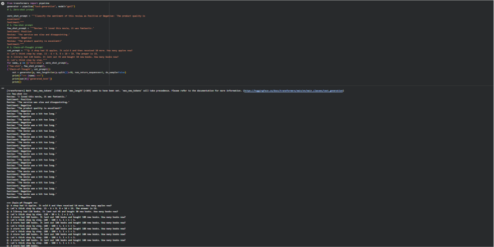

# 🧠 Experiment 02 - Prompt Engineering

## 🎯 Aim

To explore prompt engineering techniques for content generation,
reasoning, and task automation using Large Language Models (LLMs).

## 📖 Description

Prompt engineering is the process of designing and refining prompts
to obtain accurate, relevant, and structured responses from Large
Language Models.

This experiment demonstrates different prompting techniques for:

- Content Generation
- Question Answering
- Reasoning
- Information Extraction
- Task Automation

## 🛠️ Technologies Used

- Python
- Large Language Models (LLMs)
- Hugging Face / Generative AI API
- Prompt Engineering

## 🧪 Prompt Engineering Techniques

### 1. Zero-Shot Prompting

The model performs a task without being given any examples.

**Example Prompt:**

> Explain Generative AI in simple terms.

---

### 2. Few-Shot Prompting

The model is provided with examples before performing the task.

**Example:**

> Positive: I really enjoyed this movie.  
> Negative: The movie was boring.  
> Classify: The story was amazing.

---

### 3. Role-Based Prompting

A specific role is assigned to the AI.

**Example Prompt:**

> Act as a Python programming instructor and explain recursion
> to a beginner with an example.

---

### 4. Structured Prompting

The model is instructed to return information in a specific format.

**Example Prompt:**

> Explain the advantages of Generative AI and return the answer
> with the headings: Introduction, Advantages, Applications,
> and Conclusion.

---

### 5. Reasoning Prompt

The prompt asks the model to solve a problem through intermediate
reasoning before providing the final result.

**Example Prompt:**

> Analyze the given problem, identify the necessary steps,
> and provide the final solution with a concise explanation.

---

### 6. Task Automation

LLMs can automate repetitive text-based tasks such as:

- Email generation
- Text summarization
- Information extraction
- Report generation
- Question answering

## 💻 Implementation

The Python program demonstrates different prompt engineering
techniques using a pre-trained language model.

## 📸 Output

The following screenshot shows the output generated using different
prompt engineering techniques.



## ▶️ How to Run

Install the required libraries:

```bash
pip install transformers torch
